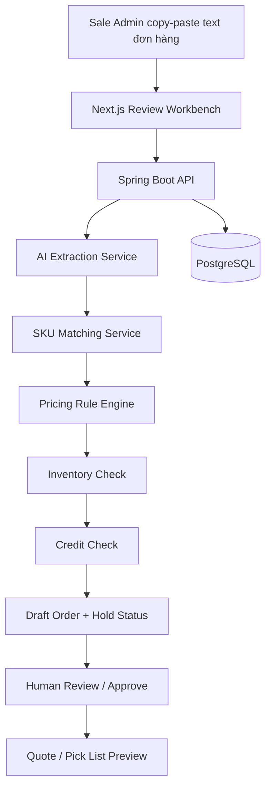

# 1. Giới Thiệu Tổng Quan (Executive Summary)
OrderFlow AI là một **AI Safe Order-Entry Workbench** dành cho Sale Admin tại các cửa hàng/nhà phân phối vật tư điện nước nhỏ và vừa, tập trung trước mắt vào nhóm **ống nhựa PVC/PP-R/HDPE và phụ kiện cấp thoát nước**.

Sản phẩm giải quyết nút thắt kinh doanh ở khâu nhập đơn: biến nội dung đặt hàng tự do của thợ, đại lý hoặc nhà thầu nhỏ thành **đơn nháp an toàn** đã được chuẩn hóa SKU, kiểm giá, kiểm tồn kho và kiểm công nợ trước khi con người duyệt. Giá trị cốt lõi không phải là “AI đọc tin nhắn”, mà là giúp nhà phân phối **bán nhanh hơn nhưng vẫn kiểm soát được rủi ro sai hàng, sai giá, thiếu tồn và vượt công nợ**.

Trong MVP hackathon, hệ thống **không tích hợp Zalo, không tích hợp ERP thật, không xử lý ảnh/voice**. Sale Admin chỉ copy-paste hoặc gõ nội dung đơn thô vào web app. Hệ thống dùng catalogue mẫu, dữ liệu giá/tồn/công nợ mô phỏng và rule engine để chứng minh luồng: **Text đơn hàng thô → AI trích xuất → SKU candidate → kiểm giá/tồn/công nợ → Sale Admin duyệt → tạo đơn nháp/báo giá/phiếu lấy hàng**.

**Luận điểm về tính tồn tại của bài toán:** OrderFlow AI không dựa trên một khảo sát duy nhất kiểu "X% đơn hàng ngành nước bị lỗi vì tiếng lóng". Báo cáo nội bộ `local/Evidence That Slang Based Plumbing Supply Orders Create Real Operational Friction.pdf` cho thấy bằng chứng theo hướng cộng dồn:
- Catalogue chính hãng trong ngành ống/phụ kiện có cấu trúc rất phân nhánh: cùng một kích thước có thể tách theo vật liệu, hệ inch/mét, PN/độ dày, kiểu ren, co 45/90, tê đều/tê giảm, ren nhựa/ren đồng.
- Ngôn ngữ mua bán công khai ngoài thị trường lại thường bị nén thành các cụm ngắn như "co 27", "tê 27", "lơi 27", "nối ren trong 27", "ống nóng 25".
- Các tài liệu vận hành kho và benchmark order accuracy cho thấy sai SKU/sai số lượng tạo ra backorder, trả hàng, rework và bất mãn khách hàng. Vì vậy tiếng lóng ở đầu vào là một nguồn rủi ro upstream của order accuracy.

**Ranh giới claim:** Tài liệu này đưa ra cơ sở hợp lý rằng bài toán có thật và MVP có thể kiểm chứng luồng xử lý. Tài liệu này **chưa** khẳng định đã có product-market fit, chưa khẳng định ROI 50-70% là kết quả thực tế, và chưa khẳng định khách hàng sẵn sàng trả tiền trước khi có interview/pilot. Những điểm đó được đưa vào kế hoạch kiểm chứng sau hackathon.

**Vị trí so với hệ thống hiện có:** OrderFlow AI không thay thế ERP/POS/kế toán, và cũng không phải chatbot trả lời khách tự động. Hệ thống nằm ở lớp trước ERP: chuẩn hóa đơn thô, làm rõ SKU, kiểm rule mô phỏng và tạo đơn nháp có audit trail để con người duyệt. Nếu đi vào pilot/product, output có thể được export/import sang phần mềm bán hàng hiện có trước khi tính đến tích hợp API thật.

**Điểm mạnh business của dự án**
- **Pain gắn trực tiếp với tiền và vận hành.** Sai SKU, sai size, thiếu tồn hoặc vượt công nợ không chỉ là lỗi nhập liệu; nó kéo theo đổi trả, giao lại, chậm công trình, mất biên lợi nhuận và mất uy tín với thợ/đại lý.
- **Vertical wedge đủ hẹp để làm sâu.** Dự án không cố giải toàn bộ bán hàng B2B, mà chọn một ngách có SKU kỹ thuật cao, nhiều alias, nhiều biến thể gần giống nhau và workflow lặp lại hằng ngày. Đây là môi trường phù hợp để một workflow AI chuyên ngành tạo khác biệt so với chatbot chung.
- **Không ép khách cuối đổi hành vi.** Thợ/đại lý vẫn đặt hàng bằng ngôn ngữ tự nhiên; thay đổi chủ yếu nằm ở phía Sale Admin, nơi có thể kiểm soát bằng training nội bộ và pilot shadow mode.
- **Có buyer, user và risk owner rõ ràng.** Chủ cửa hàng/chủ nhà phân phối mua vì tốc độ và giảm sai đơn; Sale Admin dùng hằng ngày; kế toán/kho hưởng lợi từ hold và audit trail. Điều này giúp câu chuyện bán hàng không bị mơ hồ.
- **Human-in-the-loop làm tăng khả năng được chấp nhận.** Hệ thống không tự duyệt đơn, không tự override giá/tồn/công nợ, nên phù hợp với môi trường SME còn phụ thuộc vào niềm tin, kinh nghiệm nhân viên và kiểm soát rủi ro thủ công.
- **Pilot có thể đo được bằng số vận hành.** `Time to Safe Draft`, tỷ lệ clarification, tỷ lệ sửa SKU, tỷ lệ hold đúng và số lỗi tránh được là các chỉ số đủ cụ thể để đánh giá ROI, thay vì chỉ demo cảm tính.
- **Có đường mở rộng hợp lý sau khi thắng ngách đầu tiên.** Nếu chứng minh được với ống/phụ kiện nước, logic alias + SKU candidate + rule engine có thể mở ngang sang van, thiết bị MEP, phụ kiện điện nước và các nhóm VLXD có SKU phức tạp tương tự.

# 2. Vấn Đề & Thách Thức (Pain Points)
| Mã | Mô tả vấn đề | Hậu quả / Ảnh hưởng |
|---|---|---|
| P1 | **Đơn hàng không đi vào theo form chuẩn.** Khách thường đặt bằng ngôn ngữ công trình như “ống 25 nóng”, “co 25”, “co ren trong”, “tê giảm”, “lấy giống đơn trước”, “giao công trình cũ”. Nội dung thường thiếu thương hiệu, vật liệu, PN/áp lực, hệ kích thước, loại phụ kiện, đơn vị tính hoặc công trình giao hàng. | Sale Admin phải đọc, đoán, tra lịch sử, hỏi lại khách và nhập tay. Khi số đơn tăng, khâu nhập đơn trở thành bottleneck, phản hồi chậm, dễ bỏ sót đơn và khó tăng số đơn/ngày nếu không tăng nhân sự. |
| P2 | **SKU ngành ống/phụ kiện dễ nhầm và có tính kỹ thuật cao.** Một cách gọi ngắn có thể trỏ đến nhiều SKU khác nhau. “Ống 25” có thể khác vật liệu, thương hiệu, PN, độ dày, hệ inch/mét, cây/mét/cuộn. “Co 25” có thể là co 90, co 45, co ren trong, co ren ngoài, co trơn hoặc co đồng. | Dễ giao sai hàng dù kho vẫn xuất được. Công trình không lắp được, phát sinh đổi trả, tốn vận chuyển, chậm tiến độ và mất uy tín với thợ/đại lý. |
| P3 | **Giá, tồn kho và công nợ đang được kiểm tra rời rạc.** Giá có thể khác theo khách, công trình, số lượng, thời điểm báo giá và chính sách chiết khấu. Tồn kho phải trừ hàng đã giữ cho đơn khác. Công nợ phải xét dư nợ hiện tại, nợ quá hạn, hạn mức và các đơn đã duyệt nhưng chưa thu tiền. | Sale có thể chốt sai giá, nhận đơn khi không đủ hàng hoặc cho giao thêm dù khách đã vượt hạn mức. Sai sót thường chỉ bị phát hiện muộn bởi kho hoặc kế toán. |
| P4 | **Phê duyệt ngoại lệ thiếu một màn hình kiểm soát chung.** SKU không chắc cần Sale Admin xác nhận, giá đặc biệt cần quản lý duyệt, thiếu hàng cần kho quyết định, vượt công nợ cần kế toán duyệt. Hiện tại các bước này thường nằm rải rác trong chat, gọi điện, Excel hoặc phần mềm bán hàng. | Đơn bị treo, khó biết đang vướng ở đâu. Khi có sai sót, doanh nghiệp khó truy lại ai đã chọn SKU, ai sửa giá, ai duyệt qua công nợ và vì sao đơn được xuống kho. |

# 3. Mục Tiêu & Tiêu Chí Đo Lường (Objectives & KPIs)
| Mục tiêu chiến lược | Con số kỳ vọng | Phương pháp / Công cụ đo lường |
|---|---|---|
| Chứng minh được luồng order-entry end-to-end | Demo được 3 kịch bản chính trong hackathon | Chạy trực tiếp trên web app: text input → draft order → hold/approve → output |
| Rút ngắn thời gian tạo đơn nháp an toàn | MVP mục tiêu dưới 60 giây cho đơn rõ ràng; giả thuyết pilot giảm 50–70% thời gian xử lý đơn rõ | Log thời gian từ `RawOrderText` đến `READY_FOR_REVIEW` |
| Tăng khả năng chọn đúng SKU | Với test set seed, hệ thống trả về đúng SKU trong Top-3 candidate cho các case đã chuẩn bị | Test set gồm “ống 25 nóng”, “co ren trong”, “tê giảm”, “lấy giống đơn trước” |
| Không để AI đoán bừa khi thiếu thông tin | 100% dòng hàng thiếu thuộc tính quan trọng phải vào `NEEDS_CLARIFICATION` | Rule kiểm confidence, số candidate và missing attributes |
| Chặn rủi ro kinh doanh trước khi xuống kho | 100% case thiếu tồn, vượt công nợ hoặc giá cần duyệt trong test set phải sinh hold tương ứng | Rule engine tạo `STOCK_HOLD`, `CREDIT_HOLD`, `PRICE_HOLD` |
| Tạo dữ liệu để đo ROI sau hackathon | Lưu được audit trail và processing log cho từng đơn | Bảng `audit_events`, `draft_orders`, `draft_order_lines` |

**North Star Metric:** `Time to Safe Draft` - thời gian từ đơn thô đến đơn nháp đã có SKU candidate, đã kiểm giá, tồn kho, công nợ và sẵn sàng cho Sale Admin duyệt.

Lưu ý: Các con số ROI hiện là **giả thuyết cần kiểm chứng bằng pilot**, không phải kết quả đã xác nhận.

# 4. Đối Tượng Thụ Hưởng & Giá Trị Kinh Doanh (Stakeholders & Business Value)
| Đối tượng | Vai trò | Giá trị nhận được / Mục đích sử dụng |
|---|---|---|
| Chủ cửa hàng / Chủ nhà phân phối | Người ra quyết định mua | Tăng tốc xử lý đơn, giảm chi phí nhập liệu, giảm sai hàng, bảo vệ biên lợi nhuận, kiểm soát thiếu tồn và công nợ trước khi hàng xuống kho. |
| Sale Admin / Nhân viên bán hàng | Người dùng chính trong MVP | Chuyển từ nhập liệu thủ công sang review đơn nháp. Tập trung xử lý ngoại lệ thay vì gõ lại đơn và tra cứu rời rạc. |
| Kế toán công nợ | Người kiểm soát rủi ro tín dụng | Nhận cảnh báo `CREDIT_HOLD` khi đơn có nguy cơ vượt hạn mức hoặc khách có nợ quá hạn. |
| Thủ kho | Người xử lý sau khi đơn được duyệt | Chỉ nhận phiếu lấy hàng khi đơn đã pass các bước kiểm tra cần thiết. Giảm tình trạng đơn xuống kho nhưng thiếu hàng hoặc sai mã. |
| Khách hàng cuối: thợ, đại lý, nhà thầu nhỏ | Người đặt hàng | Không cần đổi thói quen đặt hàng ở phía khách. Vẫn có thể nhắn/gọi theo ngôn ngữ tự nhiên; trong MVP, Sale Admin copy-paste nội dung thô vào hệ thống để xử lý. |

**First Customer Hypothesis:** cửa hàng/nhà phân phối vật tư điện nước nhỏ và vừa, có 3–20 nhân sự, 1 kho chính, bán ống PVC/PP-R/HDPE và phụ kiện. Đây là giả thuyết khách hàng đầu tiên, cần kiểm chứng tiếp bằng phỏng vấn và pilot sau hackathon.

# 5. Phạm Vi Tổng Quan (High-level Scope)
**In-Scope cho MVP Hackathon**
- Web app nhận nội dung đơn hàng dạng text copy-paste.
- AI trích xuất thông tin từ đơn thô:
  - khách hàng/công trình nếu có trong text;
  - ngày giao hoặc ghi chú giao hàng;
  - dòng hàng, số lượng, đơn vị;
  - thuộc tính sản phẩm như vật liệu, thương hiệu, đường kính, PN, loại phụ kiện.
- Catalogue mẫu khoảng 50 SKU mô phỏng theo cấu trúc ngành ống/phụ kiện:
  - ống PP-R nhiều PN;
  - PVC hệ inch/mét;
  - HDPE;
  - co 90/co 45;
  - co ren trong/ren ngoài;
  - tê đều/tê giảm;
  - đơn vị cây/mét/cuộn/cái.
- Alias và tên gọi lóng: co/cút/nối góc, ống nóng, tê giảm, phi 25, ren trong, ren ngoài.
- Lịch sử đơn mẫu theo khách hàng/công trình để demo case "lấy giống đơn trước" ở mức proof-of-flow.
- SKU matching trả về candidate và lý do đề xuất.
- Rule engine mô phỏng:
  - giá theo khách hàng;
  - tồn kho khả dụng;
  - công nợ và hạn mức;
  - hold khi vi phạm điều kiện bán/giao.
- Review Workbench cho Sale Admin:
  - xem text gốc;
  - xem dòng hàng AI trích xuất;
  - xem SKU candidate;
  - sửa/chọn SKU;
  - approve hoặc đưa vào clarification/hold.
- Audit trail ghi lại AI đề xuất gì, người dùng sửa gì, ai duyệt gì, lúc nào.
- Output demo: draft order và preview báo giá/phiếu lấy hàng.

**Out-of-Scope cho MVP Hackathon**
- Không tích hợp Zalo OA/API.
- Không tự động đọc tin nhắn từ kênh chat.
- Không xử lý ảnh/OCR/voice.
- Không tích hợp ERP/KiotViet/MISA thật.
- Không làm mobile app.
- Không làm multi-warehouse phức tạp.
- Không làm phân quyền nhiều role hoàn chỉnh.
- Không tự động gửi xác nhận cho khách.
- Không tự động approve SKU, giá, tồn kho hoặc công nợ.
- Không xử lý hóa đơn điện tử, giao vận, thanh toán, đổi trả.

# 6. Giải Pháp Công Nghệ & Kiến Trúc (Tech Stack)
| Layer | Công nghệ | Lý do chọn / Ứng dụng |
|---|---|---|
| Frontend | Next.js | Xây nhanh Review Workbench, form nhập text, bảng SKU candidate, hold status và màn hình approve. |
| Backend | Spring Boot | Xử lý business rules: pricing, inventory, credit, approval workflow, audit trail. |
| Database | PostgreSQL | Lưu catalogue mẫu, alias, khách hàng, giá, tồn kho, công nợ, đơn nháp và audit events. |
| AI Integration | OpenAI API | Structured extraction từ text thô, tạo SKU candidate reasoning, sinh câu hỏi clarification. |
| Document Output | HTML/PDF preview | Sinh preview báo giá hoặc phiếu lấy hàng ở mức demo. |

**Luận điểm khả thi của MVP:** Phần khó của MVP không nằm ở việc tích hợp kênh chat hay ERP, mà nằm ở việc chứng minh pipeline kiểm soát được một đơn thô: trích xuất có cấu trúc, match SKU candidate, phát hiện thiếu thuộc tính, chạy rule giá/tồn/công nợ và bắt buộc human review. Vì scope chỉ có text input, khoảng 50 SKU seed, 3 khách hàng mẫu, 1 kho mẫu và rule deterministic, luồng này có thể hoàn thành ở mức POC trong hackathon mà không phụ thuộc vào dữ liệu khách hàng thật.

**Cách giảm rủi ro kỹ thuật:** Output của AI phải được ép schema và validate ở backend. Nếu thiếu trường quan trọng, confidence thấp hoặc nhiều SKU tương đương, hệ thống không được tự chọn mà chuyển sang `NEEDS_CLARIFICATION`. Giá, tồn kho, công nợ không do LLM quyết định mà do rule engine tính từ seed data.

**Kiến trúc tổng quan**

**Nguyên tắc kỹ thuật cốt lõi**
- AI xử lý ngôn ngữ tự nhiên, trích xuất dữ liệu và đề xuất SKU.
- Backend xử lý giá, tồn kho, công nợ và điều kiện duyệt bằng logic xác định.
- Con người là người duyệt cuối cùng.
- Case mơ hồ phải hỏi lại hoặc đưa vào hold, không tự đoán.
- Mọi thay đổi quan trọng phải có audit trail.

# 7. Lộ Trình Phát Triển (Roadmap / Milestones)
**Phase 1 - Hackathon POC**
- Mục tiêu: chứng minh luồng order-entry cốt lõi chạy được và có business value nhìn thấy được.
- Phạm vi: Text-only intake; 50 SKU mẫu có chủ đích để tạo case mơ hồ; 3 khách hàng mẫu; 1 kho mẫu; lịch sử đơn mẫu cho repeat-order; Giá/tồn/công nợ mô phỏng; 1 màn hình chính cho Sale Admin; 3 kịch bản demo (Đơn rõ đủ hàng không vượt công nợ, Đơn mơ hồ SKU cần clarification, Đơn repeat order nhưng thiếu tồn hoặc vượt công nợ).

**Phase 2 - Pilot sau Hackathon**
- Mục tiêu: kiểm chứng ROI thực tế bằng shadow mode.
- Phạm vi: Chạy song song với cách làm hiện tại tại 1 cửa hàng/nhà phân phối; Import 100–300 SKU bán chạy nhất từ Excel; Đo baseline; Chưa ghi trực tiếp vào ERP/phần mềm bán hàng.

**Phase 3 - Productization**
- Mục tiêu: biến POC thành SaaS có thể triển khai lặp lại.
- Phạm vi: Import catalogue từ Excel; Quản lý alias theo khách hàng/công trình; Phân quyền Sales/Kế toán/Kho; Báo cáo thời gian xử lý đơn và exception rate; Tích hợp phần mềm bán hàng/kế toán khi khách hàng có nhu cầu; Tích hợp Zalo OA/OCR/voice sau khi đã chứng minh value lõi.

**Mô hình kinh doanh dự kiến - còn là giả thuyết**
- Setup fee: phí chuẩn hóa/import catalogue, bảng giá, khách hàng, tồn kho.
- SaaS monthly fee: thuê bao theo số user, số đơn hoặc quy mô catalogue.
- Pilot ban đầu có thể miễn phí hoặc giá thấp để đổi lấy dữ liệu đo lường và case study.

**Kế hoạch kiểm chứng business sau hackathon**
- **Chốt ICP hẹp cho pilot:** ưu tiên cửa hàng/nhà phân phối có 3-20 nhân sự, có Sale Admin hoặc người chuyên nhập đơn, nhận nhiều đơn qua Zalo/gọi điện mỗi ngày, có 300+ SKU hoặc nhiều SKU dễ nhầm, có bán công nợ và đang quản lý giá/tồn/công nợ bằng Excel/POS/kế toán rời rạc.
- **Phỏng vấn theo hướng "show me the workflow":** thực hiện 10 cuộc phỏng vấn ngắn, yêu cầu người dùng mở 5 đơn gần nhất và mô tả từng bước từ tin nhắn thô đến báo giá/phiếu lấy hàng. Câu hỏi trọng tâm: mất bao lâu, phải tra ở đâu, lúc nào hỏi lại khách, từng sai SKU/size/ren chưa, từng nhận đơn rồi mới phát hiện thiếu tồn/vượt công nợ chưa.
- **Pilot shadow mode 2 tuần:** Sale Admin vẫn vận hành như cũ, nhưng copy-paste cùng đơn vào OrderFlow AI để so sánh. Không ghi trực tiếp vào ERP/POS trong giai đoạn này. Mục tiêu là đo baseline và chứng minh hệ thống tạo đơn nháp an toàn nhanh hơn với đơn rõ ràng, đồng thời phát hiện tốt case mơ hồ/rủi ro.
- **Xử lý phản biện copy-paste bằng trải nghiệm cực nhanh:** MVP cần tối ưu thao tác paste, nhận diện khách/công trình gần đây, gợi ý lịch sử đơn, và tạo báo giá/phiếu lấy hàng ngay sau review. Luận điểm business: thêm vài giây copy-paste để giảm nhiều phút tra SKU, giá, tồn kho và công nợ.
- **Giảm rủi ro onboarding dữ liệu:** pilot không import toàn bộ catalogue ngay, mà bắt đầu từ 100-300 SKU bán chạy nhất, nhóm alias hay nhầm và bảng giá/tồn/công nợ mẫu. Dùng Excel template cố định để chuẩn hóa dữ liệu, sau đó mới mở rộng catalogue.
- **Kiểm chứng willingness-to-pay bằng cam kết cụ thể:** cuối pilot không chỉ hỏi "anh/chị có thích không", mà hỏi về setup fee, monthly fee, người có quyền quyết định mua, điều kiện để ký pilot trả phí và chỉ số ROI tối thiểu họ cần thấy.
- **Định vị bán hàng:** OrderFlow AI là lớp nhập đơn an toàn trước ERP/POS, không phải phần mềm kế toán mới. Cách bán ban đầu nên là "giảm sai đơn và tăng tốc tạo đơn nháp" thay vì "thay thế hệ thống hiện tại".

**Điều kiện Go/No-Go sau pilot**
- Go nếu 3-5 cuộc phỏng vấn xác nhận Sale Admin thực sự tốn thời gian đáng kể cho dịch tiếng lóng, tra SKU, kiểm tồn/giá/công nợ.
- Go nếu shadow mode trên một tập đơn thật cho thấy hệ thống giảm rõ `Time to Safe Draft` với đơn rõ ràng và tăng khả năng phát hiện case mơ hồ/rủi ro trước khi xuống kho.
- Go nếu chủ cửa hàng thấy giá trị ở audit trail, giảm sai đơn hoặc tăng tốc phản hồi đủ để cân nhắc trả setup fee/SaaS fee.
- No-Go hoặc pivot nếu phần lớn đơn đã có form chuẩn, SKU đơn giản, công nợ/tồn kho không phải bottleneck, hoặc khách hàng không sẵn sàng đưa catalogue/bảng giá vào hệ thống.

# 8. Rủi Ro & Biện Pháp Giảm Thiểu (Risks & Mitigations)
| Rủi ro | Hậu quả | Biện pháp phòng ngừa | Biện pháp xử lý |
|---|---|---|---|
| Scope MVP quá rộng | Không kịp demo, sản phẩm không chạy được | Chốt text-only, 1 user, 1 luồng, dữ liệu seed | Cắt PDF/OCR/Zalo trước, giữ luồng draft order + hold |
| AI trích xuất sai hoặc chọn sai SKU | Demo mất niềm tin, rủi ro nghiệp vụ | Dùng structured output, candidate list, confidence, missing attributes | Đưa dòng hàng vào `NEEDS_CLARIFICATION`, cho Sale Admin chọn thủ công |
| Dữ liệu SKU mẫu không đủ sắc | Không chứng minh được domain complexity | Seed SKU có chủ đích: PN khác nhau, co 90/45, ren trong/ngoài, inch/mét, cây/mét | Tập trung demo 3 case đã chuẩn bị kỹ |
| Rule giá/tồn/công nợ lỗi | Không chứng minh được business value | Viết rule đơn giản, deterministic, có test case | Dùng fallback seed data hard-coded cho demo |
| OpenAI API lỗi hoặc response không ổn định | Demo extraction gián đoạn | Dùng schema validation, retry nhẹ, test prompt trước demo | Chuẩn bị extraction fixture cho 3 kịch bản để vẫn demo được rule engine và review flow |
| Pitch bị hiểu là sẽ tích hợp Zalo/ERP ngay | Bị bắt lỗi tính khả thi | Ghi rõ MVP không tích hợp kênh/ERP, chỉ copy-paste text | Nói Zalo/OCR/ERP là roadmap sau pilot |
| ROI bị xem là hứa quá tay | Mất độ tin cậy với giám khảo | Gọi ROI là giả thuyết cần đo | Tập trung vào khả năng đo baseline và shadow-mode pilot |
| First customer chưa được phỏng vấn trực tiếp | Market thesis thiếu bằng chứng thực địa | Ghi rõ đây là proto-persona/hypothesis | Sau hackathon ưu tiên 3–5 interview và 1 pilot nhỏ |
| Khách hàng không sẵn sàng trả tiền | Có pain nhưng chưa thành business | Tách rõ PoC kỹ thuật, pilot đo ROI và willingness-to-pay | Dùng pilot để kiểm chứng setup fee, monthly fee và ngưỡng giá trị tối thiểu |

# 9. Thuật Ngữ & Quy Định Chung (Glossary & Global Rules)
### 9.1 Thuật ngữ cốt lõi (Glossary)
| Thuật ngữ | Tiếng Anh trong code | Ý nghĩa / Giải thích |
|---|---|---|
| Đơn thô | `RawOrderText` | Nội dung đặt hàng được Sale Admin copy-paste hoặc gõ lại từ tin nhắn/gọi điện/ghi chú. |
| Đơn nháp | `DraftOrder` | Đơn được hệ thống tạo ra sau khi trích xuất, match SKU và kiểm rule, chưa phải đơn chính thức. |
| Đơn nháp an toàn | `SafeDraft` | Đơn nháp đã có SKU candidate, giá, tồn kho, công nợ và trạng thái hold/approve rõ ràng. |
| Dòng hàng thô | `RawOrderLine` | Một dòng sản phẩm được AI tách ra từ đơn thô. |
| Mã SKU | `SKU` | Mã sản phẩm kỹ thuật duy nhất trong catalogue. |
| Danh pháp lóng | `ProductAlias` | Cách gọi không chuẩn của khách như co, cút, ống nóng, tê giảm, phi 25. |
| Ứng viên SKU | `SkuCandidate` | Danh sách SKU có khả năng khớp với dòng hàng thô, kèm điểm tin cậy và lý do. |
| Cần làm rõ | `NEEDS_CLARIFICATION` | Trạng thái khi thiếu thông tin hoặc có nhiều SKU tương đương. |
| Chặn tồn kho | `STOCK_HOLD` | Trạng thái khi tồn khả dụng nhỏ hơn số lượng yêu cầu. |
| Chặn công nợ | `CREDIT_HOLD` | Trạng thái khi đơn có nguy cơ vượt hạn mức hoặc khách có nợ quá hạn. |
| Chặn giá | `PRICE_HOLD` | Trạng thái khi giá cần quản lý duyệt, ví dụ giá đặc biệt hoặc giá thấp hơn ngưỡng. |
| Lưu vết | `AuditTrail` | Log ghi lại AI đề xuất gì, người dùng sửa gì, ai duyệt gì, lúc nào. |

### 9.2 Ràng buộc nghiệp vụ cốt lõi (Global Business Constraints)
- **AI không tự duyệt đơn.** AI chỉ được trích xuất, đề xuất SKU, sinh câu hỏi clarification và giải thích lý do.
- **AI không tự chọn SKU khi thiếu thông tin.** Nếu có nhiều candidate hợp lý hoặc thiếu thuộc tính quan trọng như thương hiệu, PN, hệ kích thước, loại phụ kiện, hệ thống phải chuyển sang `NEEDS_CLARIFICATION`.
- **Rule engine quyết định giá/tồn/công nợ.** LLM không được tự tính hoặc tự override các rule này.
- **Đơn có hold không được xuống kho.** Chỉ đơn không còn `STOCK_HOLD`, `CREDIT_HOLD`, `PRICE_HOLD` và đã được người dùng approve mới được sinh phiếu lấy hàng.
- **Mọi thao tác quan trọng phải có audit trail.** Bao gồm AI extraction, SKU candidate, sửa SKU, sửa số lượng, approve, reject và release hold.
- **MVP không hứa tích hợp thật.** Zalo, OCR, voice, ERP integration là roadmap sau pilot, không thuộc phạm vi hackathon POC.
- **ROI là giả thuyết cần đo.** Hệ thống phải tạo được log để đo thời gian xử lý, tỷ lệ clarification, tỷ lệ hold và tỷ lệ sửa SKU trong pilot thực tế.
